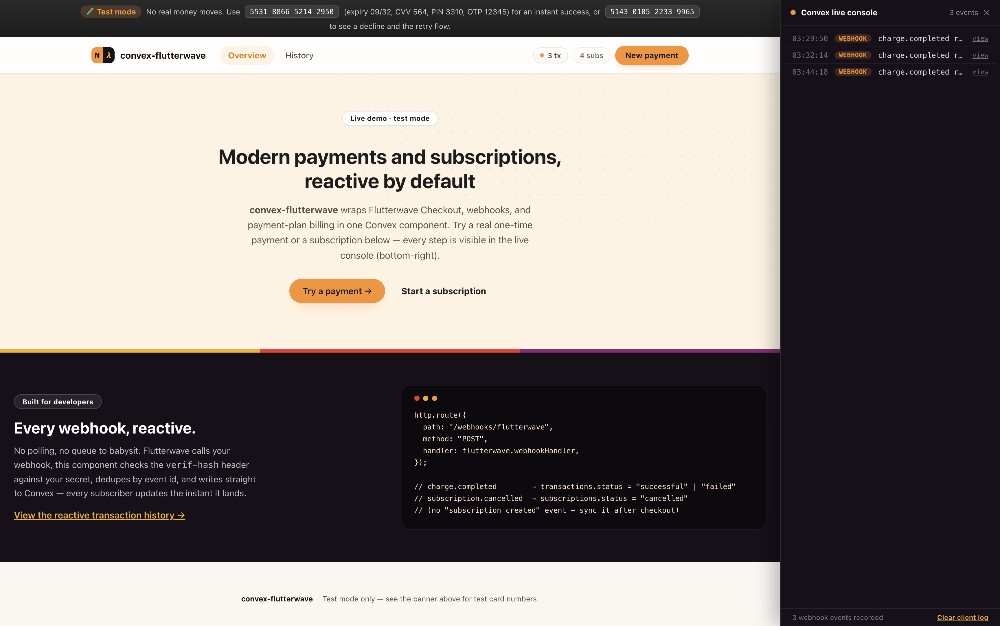

# convex-flutterwave

**Accept payments and subscriptions with Flutterwave in your Convex app.** Reactive transactions, subscription state, and webhook ingestion.

[](https://www.npmjs.com/package/convex-flutterwave)
[](https://www.convex.dev/components/sholajegede/convex-flutterwave)
[](https://www.npmjs.com/package/convex-flutterwave)
[](./LICENSE)



```ts
const flutterwave = new Flutterwave(components.convexFlutterwave, {
  secretKey: process.env.FLW_SECRET_KEY!,
  webhookSecretHash: process.env.FLW_WEBHOOK_SECRET_HASH!,
});

// Start a checkout
const { paymentLink } = await flutterwave.initializeTransaction(ctx, {
  email: "customer@example.com",
  amount: 5000,
  redirectUrl: "https://yourapp.com/payment/callback",
});

// Confirm it server-side after redirect
const result = await flutterwave.verifyTransaction(ctx, { transactionId });

// Is this customer on an active subscription?
const active = await flutterwave.hasActiveSubscription(ctx, { customerEmail: "customer@example.com" });
```

## What this does

Flutterwave fires webhook events every time a payment action happens — a charge completes, a subscription is cancelled. Without this component, you have to write and maintain your own webhook receiver, signature verification, database schema, and reactive queries.

This component owns all of that. Drop it in, mount the webhook, and your Convex app immediately has:

- **Reactive transaction state** — every transaction, live in Convex, keyed by `tx_ref`
- **Reactive subscription state** — subscription status for recurring payment plans, live in Convex
- **Checkout** — `initializeTransaction()` generates a Flutterwave-hosted payment link for one-time payments or, with a `paymentPlan`, for subscriptions
- **Plan management** — `createPaymentPlan()` / `listPaymentPlans()` manage the billing plans subscriptions are built on
- **Server-side verification** — `verifyTransaction()` confirms a transaction directly with Flutterwave
- **Subscription management** — `cancelSubscription()` / `enableSubscription()` call Flutterwave directly and keep local state in sync
- **Webhook idempotency** — duplicate deliveries of the same event are detected and skipped

> **API version:** This component uses Flutterwave's v3 Standard integration (`api.flutterwave.com/v3`) — a static secret key, not the newer v4 OAuth flow. v3 remains fully supported and is what most existing Flutterwave integrations use.

> **Webhook timing:** After a payment action occurs in Flutterwave, there is a short delay — usually a few seconds — before the webhook arrives and your Convex data updates. Once the webhook arrives, Convex's real-time reactivity propagates the change to all subscribers instantly.

## Table of Contents

- [Install](#install)
- [Quick Start](#quick-start)
- [Setup](#setup)
- [Usage](#usage)
- [Checkout](#checkout)
- [Plans](#plans)
- [Subscriptions](#subscriptions)
- [API Reference](#api-reference)
- [Type Reference](#type-reference)
- [Webhook Events](#webhook-events)
- [Database Schema](#database-schema)
- [Customer IDs](#customer-ids)
- [Testing](#testing)
- [Example App](#example-app)
- [Limitations](#limitations)
- [Troubleshooting](#troubleshooting)
- [Contributing](#contributing)
- [Changelog](#changelog)

## Install

```bash
npm install convex-flutterwave
```

**Requirements:** Convex v1.33.1 or later, Node.js 18+, a [Flutterwave](https://flutterwave.com) account

## Quick Start

Five steps to add Flutterwave to your Convex app.

### 1. Add the component

In `convex/convex.config.ts`:

```ts
import { defineApp } from "convex/server";
import convexFlutterwave from "convex-flutterwave/convex.config";

const app = defineApp();
app.use(convexFlutterwave);

export default app;
```

### 2. Set environment variables

```bash
npx convex env set FLW_SECRET_KEY FLWSECK-xxxxxxxxxxxx
npx convex env set FLW_WEBHOOK_SECRET_HASH your-chosen-secret-hash
```

`FLW_WEBHOOK_SECRET_HASH` is a random value **you** choose and enter in the Flutterwave dashboard — it's separate from your API secret key.

### 3. Mount the webhook handler

In `convex/http.ts`:

```ts
import { httpRouter } from "convex/server";
import { components } from "./_generated/api";
import { Flutterwave } from "convex-flutterwave";

const flutterwave = new Flutterwave(components.convexFlutterwave, {
  secretKey: process.env.FLW_SECRET_KEY!,
  webhookSecretHash: process.env.FLW_WEBHOOK_SECRET_HASH!,
});

const http = httpRouter();

http.route({
  path: "/webhooks/flutterwave",
  method: "POST",
  handler: flutterwave.webhookHandler,
});

export default http;
```

### 4. Register the webhook in Flutterwave

1. In Flutterwave Dashboard → **Settings → Webhooks**
2. Set the webhook URL: `https://your-deployment.convex.site/webhooks/flutterwave`
3. Set the same secret hash you stored as `FLW_WEBHOOK_SECRET_HASH`
4. Save. Flutterwave sends every event to this URL — the handler ignores events it doesn't recognize.

Your Convex site URL is in the Convex dashboard under **Settings → URL & Deploy Key** — it ends in `.convex.site`.

### 5. Initialize the client

In `convex/payments.ts`:

```ts
import { components } from "./_generated/api";
import { Flutterwave } from "convex-flutterwave";

export const flutterwave = new Flutterwave(components.convexFlutterwave, {
  secretKey: process.env.FLW_SECRET_KEY!,
  webhookSecretHash: process.env.FLW_WEBHOOK_SECRET_HASH!,
});
```

Import `flutterwave` from this file in any Convex function that needs payments.

## Setup

**`convex/payments.ts`** — your central payments module:

```ts
import { components } from "./_generated/api";
import { Flutterwave } from "convex-flutterwave";
import { action } from "./_generated/server";
import { v } from "convex/values";

export const flutterwave = new Flutterwave(components.convexFlutterwave, {
  secretKey: process.env.FLW_SECRET_KEY!,
  webhookSecretHash: process.env.FLW_WEBHOOK_SECRET_HASH!,
});

export const checkout = action({
  args: { email: v.string(), amount: v.number(), redirectUrl: v.string() },
  handler: async (ctx, args) => flutterwave.initializeTransaction(ctx, args),
});
```

**`convex/http.ts`** — webhook entry point (shown in [Quick Start](#quick-start)).

## Usage

### Start a checkout

```ts
export const checkout = action({
  args: { email: v.string(), amount: v.number() },
  handler: async (ctx, args) => {
    return await flutterwave.initializeTransaction(ctx, {
      email: args.email,
      amount: args.amount, // major currency unit — e.g. naira, not kobo
      redirectUrl: "https://yourapp.com/payment/callback",
    });
  },
});
// Returns: { paymentLink, txRef }
// Redirect the customer to paymentLink.
```

### Verify a transaction

```ts
export const confirmPayment = action({
  args: { transactionId: v.string() },
  handler: async (ctx, args) => {
    return await flutterwave.verifyTransaction(ctx, args);
  },
});
// Returns: { status, txRef, flwRef, transactionId, amount, currency, customerEmail, ... }
```

Flutterwave redirects to your `redirectUrl` with `status` and `tx_ref` query params on every outcome, and `transaction_id` **only when a chargeable attempt was made** — a card declined at the gateway or an abandoned checkout redirects back with just `status=failed` and `tx_ref`, no `transaction_id` to verify. Handle that case on your result screen rather than assuming `transaction_id` is always present.

### Read a transaction reactively

```ts
export const getTransaction = query({
  args: { txRef: v.string() },
  handler: async (ctx, args) => {
    return await flutterwave.getTransaction(ctx, args);
  },
});
// Returns: Transaction | null
```

### List a customer's transactions

```ts
export const getHistory = query({
  args: { customerEmail: v.string() },
  handler: async (ctx, args) => {
    return await flutterwave.listTransactions(ctx, {
      customerEmail: args.customerEmail,
      limit: 20,
    });
  },
});
// Returns: Transaction[] ordered newest first
```

## Checkout

`initializeTransaction()` calls Flutterwave's [Standard payment](https://developer.flutterwave.com/docs/collecting-payments/standard) endpoint, records a `pending` transaction locally, and returns the hosted payment link. Send the customer to `paymentLink`; Flutterwave redirects them back to `redirectUrl` after payment.

Call `verifyTransaction()` from your callback route (or rely on the `charge.completed` webhook) to confirm the final status — never trust the client-side redirect alone.

Two optional arguments shape what the customer sees at checkout:

- **`paymentOptions`** restricts which payment methods Flutterwave's hosted page offers — any of `"card"`, `"account"`, `"banktransfer"`, `"ussd"`, `"nqr"`, `"mpesa"`, `"mobilemoneyghana"`, `"mobilemoneyuganda"`, `"mobilemoneyrwanda"`, `"mobilemoneyzambia"`, `"barter"`, `"credit"`, `"opay"`, `"fawrypay"`. Omit it to let Flutterwave offer everything enabled on your account.
- **`paymentPlan`** turns a one-time checkout into a subscription — see [Plans](#plans).

```ts
await flutterwave.initializeTransaction(ctx, {
  email: "customer@example.com",
  amount: 5000,
  paymentOptions: ["card", "banktransfer", "ussd"],
  redirectUrl: "https://yourapp.com/payment/callback",
});
```

Unlike some processors, Flutterwave takes `amount` in the currency's **major unit** — 5000 means ₦5,000, not ₦50.00 — so there's no subunit conversion to do before calling this.

## Plans

Plans are the billing schedule a subscription is built on — a name, an interval (`hourly`, `daily`, `weekly`, `monthly`, `quarterly`, `yearly`, `bi-annually`, or `"every X <unit>"`), and optionally a fixed amount and currency. Create one, then pass its `planId` as `paymentPlan` to `initializeTransaction()`: Flutterwave automatically restricts the checkout to card payments, and the customer's first successful charge starts the subscription.

```ts
export const createProPlan = action({
  args: {},
  handler: async (ctx) => {
    return await flutterwave.createPaymentPlan(ctx, {
      name: "Pro Monthly",
      amount: 5000, // ₦5,000 — major unit, not kobo
      interval: "monthly",
      currency: "NGN",
    });
  },
});
// Returns: { planId, name, amount, interval, currency, status }

export const startSubscription = action({
  args: { email: v.string(), planId: v.string(), amount: v.number() },
  handler: async (ctx, args) => {
    return await flutterwave.initializeTransaction(ctx, {
      email: args.email,
      amount: args.amount,
      paymentPlan: args.planId,
      redirectUrl: "https://yourapp.com/payment/callback",
    });
  },
});
```

`listPaymentPlans()` returns every plan already created on your Flutterwave account, so you can check for an existing plan by name before creating a duplicate — this is exactly the pattern the [example app](#example-app) uses to bootstrap its demo plans on first run.

## Subscriptions

Flutterwave has **no "subscription created" webhook** — a subscription comes into existence the moment a customer's first charge against a `paymentPlan` succeeds, and the only events that fire afterward are `charge.completed` (each recurring charge) and `subscription.cancelled`. The `charge.completed` payload doesn't even carry the subscription's own id, only the plan id — so this component cannot create a local subscription record purely from webhooks the way it can for transactions.

Instead, call `syncCustomerSubscriptions()` right after a plan-linked checkout returns successfully — it reads the customer's live subscriptions from Flutterwave's [List Subscriptions](https://developer.flutterwave.com/v3.0/reference/list-all-subscriptions-1) endpoint and upserts them locally:

```ts
export const syncSubscriptions = action({
  args: { email: v.string() },
  handler: async (ctx, args) => {
    return await flutterwave.syncCustomerSubscriptions(ctx, { email: args.email });
  },
});
// Returns: number of subscriptions synced
```

The [example app](#example-app) calls this automatically once `verifyTransaction()` confirms a subscription checkout succeeded, and again on demand from a "Sync from Flutterwave" button on the history screen — do the same in your app rather than waiting on a webhook that will never arrive for subscription creation.

Once a subscription is known locally (synced, or updated by a later webhook), cancel/enable it directly:

```ts
export const cancelPlan = action({
  args: { subscriptionId: v.string(), customerEmail: v.string() },
  handler: async (ctx, args) => {
    await flutterwave.cancelSubscription(ctx, args);
    return null;
  },
});
```

`subscriptionId` is Flutterwave's numeric subscription id, available via `getSubscription()`, `listSubscriptions()`, or the `subscription.cancelled` webhook.

> **Test mode:** Flutterwave's sandbox appears to associate every subscription with one fixed test-customer identity — verified directly against their API, every subscription created across multiple plans and multiple different checkout emails came back with the exact same `customer.customer_email` (a `ravesb_<hash>_` — prefixed address), regardless of what email the checkout actually used. `syncCustomerSubscriptions()` already falls back to an unfiltered list and matches after stripping that prefix, which recovers subscriptions Flutterwave filed under the real email — but it can't recover a subscription in test mode at all if Flutterwave discarded the real email entirely. This has not been observed in live mode, where the real customer email is preserved correctly.
>
> For exactly that test-mode case, `syncSubscriptionsByPlan(ctx, { planId, email })` attributes every subscription on one plan to a given email, no matching required — unsafe to reach for by default since a real plan can have many subscribers, but fine when you already know (or, testing locally against your own sandbox account, can safely assume) there's one to claim. The [example app](#example-app)'s "Sync from Flutterwave" button already does this automatically as a fallback when syncing by email finds nothing, checking its own two demo plans — so testers never need to know or type Flutterwave's sandbox identity themselves.

## API Reference

| Method | Kind | Description |
| --- | --- | --- |
| `initializeTransaction(ctx, args)` | action | Starts a Flutterwave checkout, returns the hosted payment link — pass `paymentPlan` to start a subscription |
| `verifyTransaction(ctx, args)` | action | Confirms a transaction's final status with Flutterwave |
| `createPaymentPlan(ctx, args)` | action | Creates a billing plan on Flutterwave |
| `listPaymentPlans(ctx)` | action | Lists every billing plan on your Flutterwave account |
| `cancelSubscription(ctx, args)` | action | Cancels a subscription on Flutterwave and locally |
| `enableSubscription(ctx, args)` | action | Re-activates a cancelled subscription |
| `syncCustomerSubscriptions(ctx, args)` | action | Pulls a customer's subscriptions straight from Flutterwave and upserts them locally — the only way local state learns a subscription exists, since Flutterwave has no subscription-created webhook |
| `syncSubscriptionsByPlan(ctx, args)` | action | Attributes every subscription on one plan to a given email — a test-mode fallback for when Flutterwave's sandbox makes email-based sync unable to find anything (see [Subscriptions](#subscriptions)) |
| `getTransaction(ctx, args)` | query | Fetch one transaction by `tx_ref` |
| `listTransactions(ctx, args)` | query | List a customer's transactions, newest first |
| `getSubscription(ctx, args)` | query | Fetch one subscription by subscription id |
| `listSubscriptions(ctx, args)` | query | List a customer's subscriptions |
| `hasActiveSubscription(ctx, args)` | query | `true` if the customer has an active subscription |
| `listRecentEvents(ctx, args?)` | query | Raw webhook event log, newest first — audit trail or a live console |
| `getStats(ctx)` | query | Aggregate transaction/subscription/event counts for a small dashboard |

## Type Reference

```ts
type FlutterwavePaymentOption =
  | "card" | "account" | "banktransfer" | "ussd" | "nqr" | "mpesa"
  | "mobilemoneyghana" | "mobilemoneyuganda" | "mobilemoneyrwanda" | "mobilemoneyzambia"
  | "barter" | "credit" | "opay" | "fawrypay";

type InitializeTransactionArgs = {
  email: string;
  amount: number;
  currency?: string;
  redirectUrl: string;
  txRef?: string;
  customerName?: string;
  customerPhoneNumber?: string;
  paymentOptions?: FlutterwavePaymentOption[];
  paymentPlan?: string;
  metadata?: Record<string, unknown>;
};

type CreatePaymentPlanArgs = {
  name: string;
  interval: string; // e.g. "monthly", "yearly", "every 2 weeks"
  amount?: number;
  currency?: string;
  duration?: number;
};

type PaymentPlanResult = {
  planId: string;
  name: string;
  amount: number;
  interval: string;
  currency: string;
  status: string;
};

type Transaction = {
  txRef: string;
  flwRef?: string;
  transactionId?: string;
  customerEmail: string;
  amount: number;
  currency: string;
  status: "pending" | "successful" | "failed" | "cancelled";
  paymentType?: string;
  narration?: string;
  paidAt?: number;
  metadata?: string;
};

type Subscription = {
  subscriptionId: string;
  customerEmail: string;
  planId?: string;
  amount?: number;
  status: "active" | "cancelled";
};
```

## Webhook Events

Flutterwave doesn't sign webhook payloads with a computed digest — it echoes back the exact secret hash you configured in the Dashboard, verbatim, in a `verif-hash` header. The webhook handler compares that header directly (constant-time) against `FLW_WEBHOOK_SECRET_HASH` before processing anything, and de-duplicates by event id so retried deliveries are safe. It currently acts on:

| Event | Effect |
| --- | --- |
| `charge.completed` | Upserts the transaction as `successful` or `failed` |
| `subscription.cancelled` | Marks the subscription `cancelled` |

All other event types are accepted (HTTP 200) but ignored, so you can register every event on one endpoint without errors. Note there is no `subscription.created`-style event — see [Subscriptions](#subscriptions) for how this component learns a subscription exists.

## Database Schema

```ts
transactions: {
  txRef, flwRef?, transactionId?, customerEmail, amount, currency, status,
  paymentType?, narration?, paidAt?, metadata?,
  createdAt, updatedAt,
}

subscriptions: {
  subscriptionId, customerEmail, planId?, amount?, status,
  createdAt, updatedAt,
}

webhookEvents: {
  eventId, eventType, txRef?, payload, receivedAt,
}
```

Plans are not stored locally — Flutterwave is the source of truth for them, the same way it is for verified transactions. `listPaymentPlans()` reads live from Flutterwave.

`listRecentEvents()` reads `webhookEvents` directly — every event this component's webhook handler has ever received, whether or not it changed a transaction or subscription. `getStats()` returns row counts across all three tables with a full scan, intended for a small dashboard rather than a high-volume production metric.

## Customer IDs

This component keys everything on `customerEmail` — the email Flutterwave has on file for the transaction or subscription. If your app identifies customers a different way (e.g. an internal user id), keep a mapping from your own id to the email you pass into this component.

## Testing

```bash
npm run test
```

Component logic is tested with [`convex-test`](https://www.npmjs.com/package/convex-test) in `src/component/lib.test.ts`. Import `convex-flutterwave/test` in your own app to register this component's schema against your test instance.

## Example App

`example/` is a full Vite + React demo, styled with Flutterwave's and Convex's own brand colors, that exercises the entire component end to end against your own Flutterwave test-mode account:

- **One-time payment** — pick an amount and currency, choose which payment options to offer, pay, and land on a result screen driven by `verifyTransaction()`.
- **Subscriptions** — the app bootstraps two demo plans via `createPaymentPlan()` / `listPaymentPlans()` on first load and lets you subscribe to either; after a successful subscription checkout it calls `syncCustomerSubscriptions()` automatically, since Flutterwave never sends a subscription-created webhook.
- **Retry flow** — a declined or abandoned payment (including the no-`transaction_id` case Flutterwave's failure redirect produces) surfaces a "Try again" action that returns you to the same flow with your details preserved.
- **Transaction history** — a live Convex query over `listTransactions()` / `listSubscriptions()` that updates the instant a webhook lands, plus a manual "Sync from Flutterwave" button for subscriptions.
- **Live developer console** — a side-docked panel that interleaves client-side actions (checkout started, verifying…) with the real webhook log from `listRecentEvents()`, reactively, so you can watch the entire lifecycle of a payment or subscription as it happens. Click any webhook row to see its raw payload.

Run it with:

```bash
cd example
npm install
npx convex dev
# in another terminal
npm run dev
```

Use Flutterwave's [test cards](https://developer.flutterwave.com/docs/integration-guides/testing-helpers) to exercise both outcomes — `5531 8866 5214 2950` (expiry `09/32`, CVV `564`, OTP `12345`, PIN `3310`) always succeeds, `5143 0105 2233 9965` (expiry `08/32`, CVV `276`) always fails address verification so you can see the retry flow.

## Limitations

- `amount` is in the currency's major unit (e.g. naira), unlike some processors that use subunits — this component passes it through as-is.
- Only the webhook events listed above update local state; other events are received but not persisted beyond the raw idempotency record.
- There is no webhook for subscription creation — you must call `syncCustomerSubscriptions()` yourself after a plan-linked checkout succeeds (see [Subscriptions](#subscriptions)).
- `cancelSubscription` / `enableSubscription` require Flutterwave's numeric subscription id, only available after a sync, a `subscription.cancelled` webhook, or a call to `listSubscriptions()`.
- `createPaymentPlan` / `listPaymentPlans` talk to Flutterwave directly on every call — this component does not cache plans locally.
- In **test mode**, Flutterwave rewrites the customer email it echoes back in webhook and verify responses — e.g. `real@email.com` comes back as `ravesb_<hash>_real@email.com`. This component always keeps the email you originally passed to `initializeTransaction()` / `syncCustomerSubscriptions()` rather than whatever a later webhook or API response reports, so `listTransactions()` / `listSubscriptions()` stay queryable by the real address. This has not been observed in live mode.

## Troubleshooting

**Webhook returns 401** — the `verif-hash` header didn't match. Confirm `FLW_WEBHOOK_SECRET_HASH` matches exactly what's set as the secret hash in the Flutterwave Dashboard webhook settings — it is not your API secret key.

**Transaction stays `pending`** — `initializeTransaction` only records `pending`; it becomes `successful`/`failed` once the `charge.completed` webhook arrives or you call `verifyTransaction`.

**Subscription never appears** — Flutterwave doesn't send a webhook when a subscription is created, only for later charges and cancellations. Call `syncCustomerSubscriptions({ email })` after a plan-linked checkout succeeds — this is required, not just a fallback.

**No `transaction_id` after redirect** — Flutterwave only includes `transaction_id` in the redirect when a chargeable attempt was made. A declined or abandoned checkout redirects with just `status` and `tx_ref`; there's nothing to verify server-side in that case.

**A transaction/subscription doesn't show up when searching by the email you used** — if you're in Flutterwave test mode and see a `customerEmail` like `ravesb_<hash>_you@example.com` in the Convex dashboard, that's Flutterwave's sandbox rewriting the email in its own responses, not a bug in your data. Components built against 0.0.1 or earlier stored that mangled value; upgrade and re-run the flow to get the real email back.

## Contributing

See [CONTRIBUTING.md](./CONTRIBUTING.md).

## Changelog

See [CHANGELOG.md](./CHANGELOG.md).
